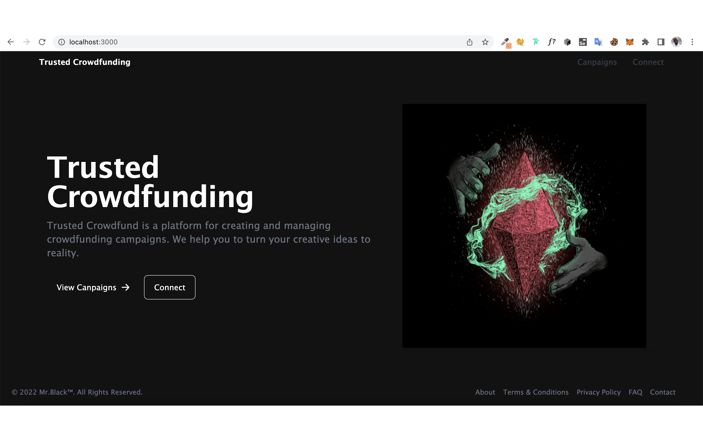

## TRUSTED CROWDFUNDING PLATFORM

## CROWDFUNDING

Crowdfunding is a process through which a business can raise small amounts of money from a large number of people using the internet. The objective is to raise sufficient funds in order to carry out a specific project.
Crowdfunding models are often used to finance new products or philanthropic endeavours, such as producing a movie or supporting victims of a natural disaster. People who give money through online platforms for these reasons are considered donors or pre-purchasers of a product. These people may receive rewards for their pledges, but do not own any stake in the business that they backed.

## Poject Description

- Trusted Crowdfunding Campaigns will help you turn your creative ideas into reality! It's where creators share new visions for creative work with the communities that will come together to fund them. No matter what, creators always control how the work comes together: no 100-page grant applications, no donors demanding you modify your message, no last-minute edits from investors. When backers chip in funding and help spread the word, they too become part of these independent works.
- Trusted Crowdfunding brings power to the Investors as well! Backed by the razor-edge security of BlockChain Technology, only after the majority of the investors have approved a Transaction Request, the transaction can be processed.
- No more being scammed by Fake Campaigns!

# Project Results

### TRUSTED CROWDFUNDING LINK

- https://uniswap-client-rk658cnfx-judinilson.vercel.app

# Getting Started

### Dependencies

- please install all the dependencies using yarn install

### Installing

- clone this repository by using git clone https://github.com/judinilson/-trusted-CrowdfundingWeb3.git
- then cd/client folder then install the dependencies
- then cd/studio folder then install the sanity dependencies
